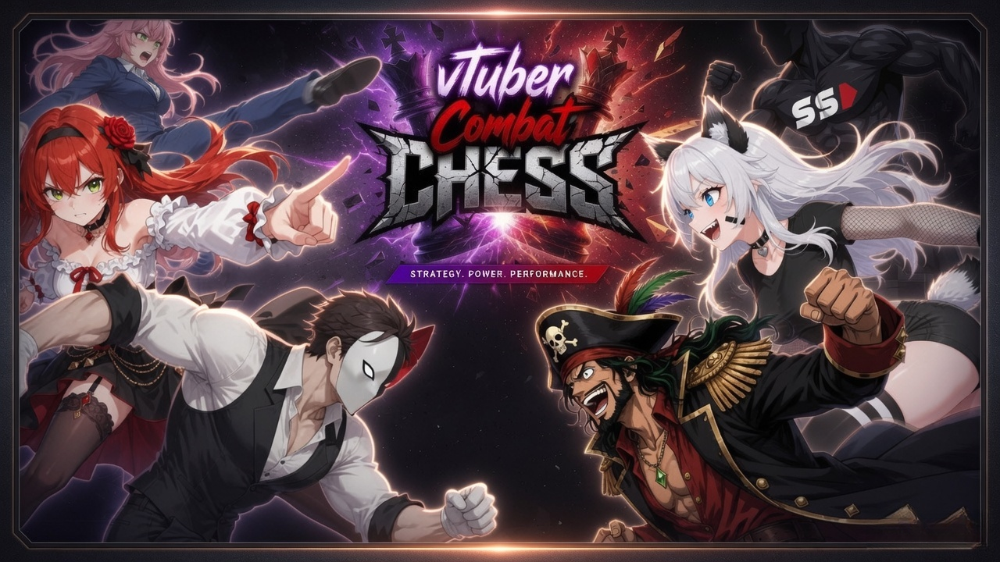
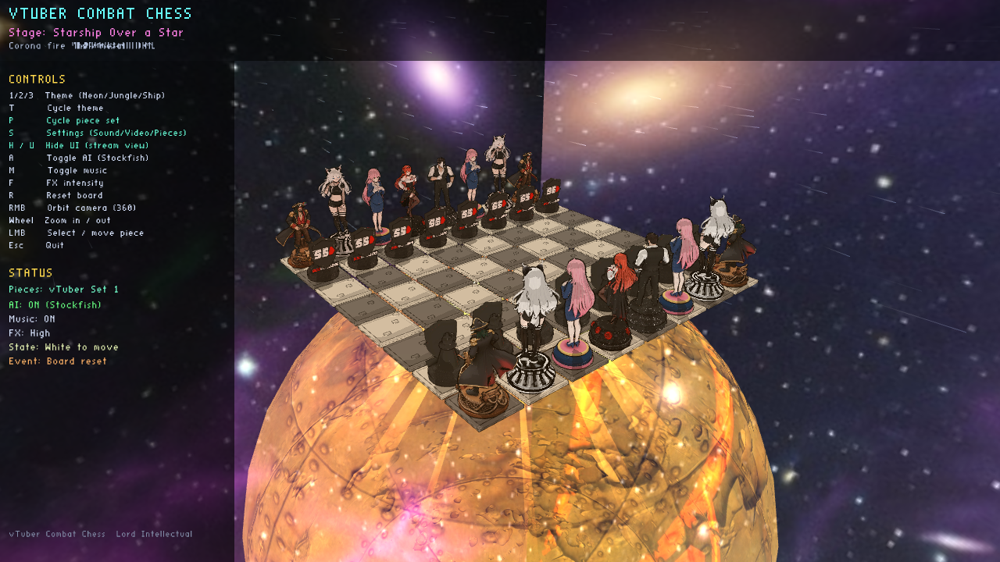
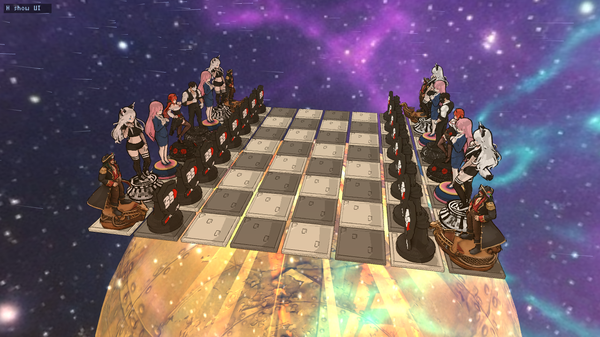
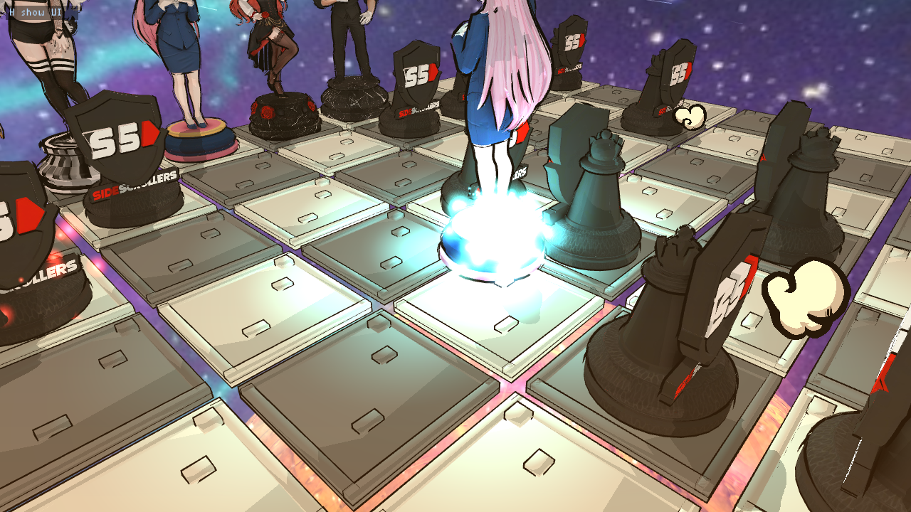
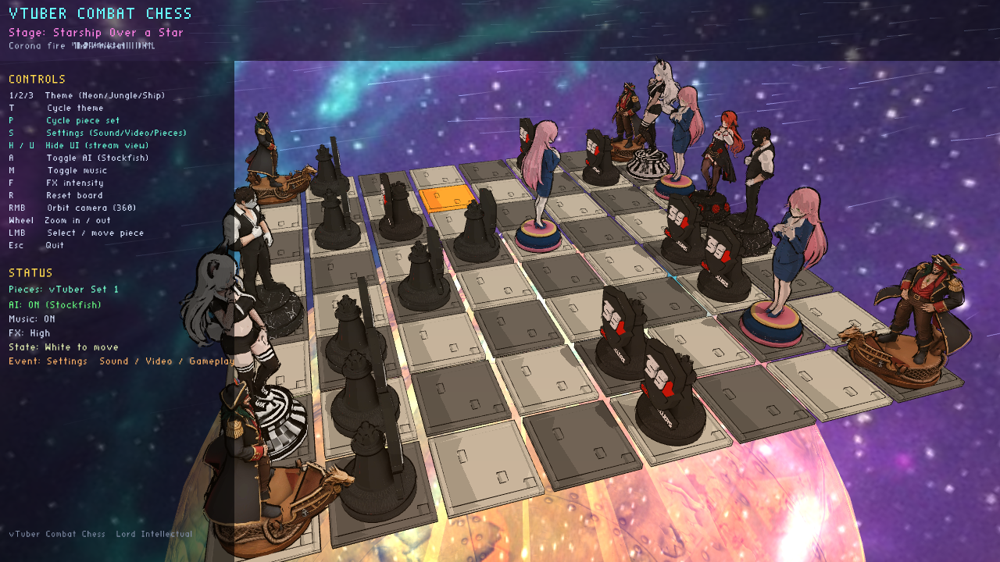

# vTuber Combat Chess












---

**Pre-alpha** 3D combat chess for streams — cel-shaded pieces, capture destruction, themed stages, and streamer-friendly controls.

| | |
|---|---|
| **Author** | Lord Intellectual |
| **Contact** | [x.com/LordIntellectX](https://x.com/LordIntellectX) |
| **This branch** | **`windows`** — Windows 11 port (work in progress) |
| **Linux** | Use branch [`main`](https://github.com/LordIntellectual/vtuber-combat-chess/tree/main) |
| **License** | [GNU GPL v3](LICENSE) |
| **Status** | Pre-alpha — no warranty, no support |

## Important: no warranty, no support, no pull requests

This software is provided **as is**, with **no warranty** of any kind.  
There is **no official support**. You may download, compile, and run it at your own risk.

**Pull requests are not accepted.** You may **fork** under the GPL. See [CONTRIBUTING.md](CONTRIBUTING.md).

## Windows 11 (this branch)

Full instructions: **[docs/BUILD_WINDOWS.md](docs/BUILD_WINDOWS.md)**

Short version (PowerShell, after installing VS 2022 C++ tools, CMake, and vcpkg libpng):

```powershell
git clone -b windows https://github.com/LordIntellectual/vtuber-combat-chess.git
cd vtuber-combat-chess
$env:VCPKG_ROOT = "$env:USERPROFILE\vcpkg"   # if you use vcpkg
.\install_and_build.ps1
# Place stockfish.exe in local\bin or on PATH
.\run.ps1
```

You need a **Stockfish** Windows binary for the AI opponent (`stockfish.exe`).

## Linux

Use the **`main`** branch and `./install_and_build.sh` / `./run.sh`.

## Features (pre-alpha)

- Play vs **Stockfish** (or human vs human with AI off)
- Capture **destruction physics** (Bullet fragments), sparks / neon trails
- Action camera on captures; checkmate / forfeit victory screens
- Themes: Cyber Neon Lounge, Bioluminescent Jungle, Starship Over a Star
- Piece sets including classic, starship, space, and vTuber-style sets
- Streamer HUD, settings (sound / video / gameplay)

## Controls (summary)

| Key | Action |
|-----|--------|
| **1 / 2 / 3** | Theme |
| **T** | Cycle theme |
| **A** | Toggle AI (Stockfish) |
| **M** | Toggle music |
| **F** | FX intensity |
| **R** | Reset board |
| **S** | Settings |
| **P** | Cycle piece set |
| **H** | Toggle HUD |
| **Esc** | Quit |
| **RMB drag** | Orbit camera |
| **LMB** | Select / move |

## Credits

- **Author / direction:** Lord Intellectual  
- **Base engine:** [ToonChess](https://github.com/martinRenou/ToonChess) by Martin Renou (GPL-3)  
- **AI opponent:** [Stockfish](https://stockfishchess.org/) (install separately)  
- **Physics:** Bullet Physics 2.87  
- **Implementation assistance:** AI coding agents (including Grok / xAI and others), under Lord Intellectual’s direction  

## License

GNU General Public License version 3 — see [LICENSE](LICENSE) and [NOTICE](NOTICE).
